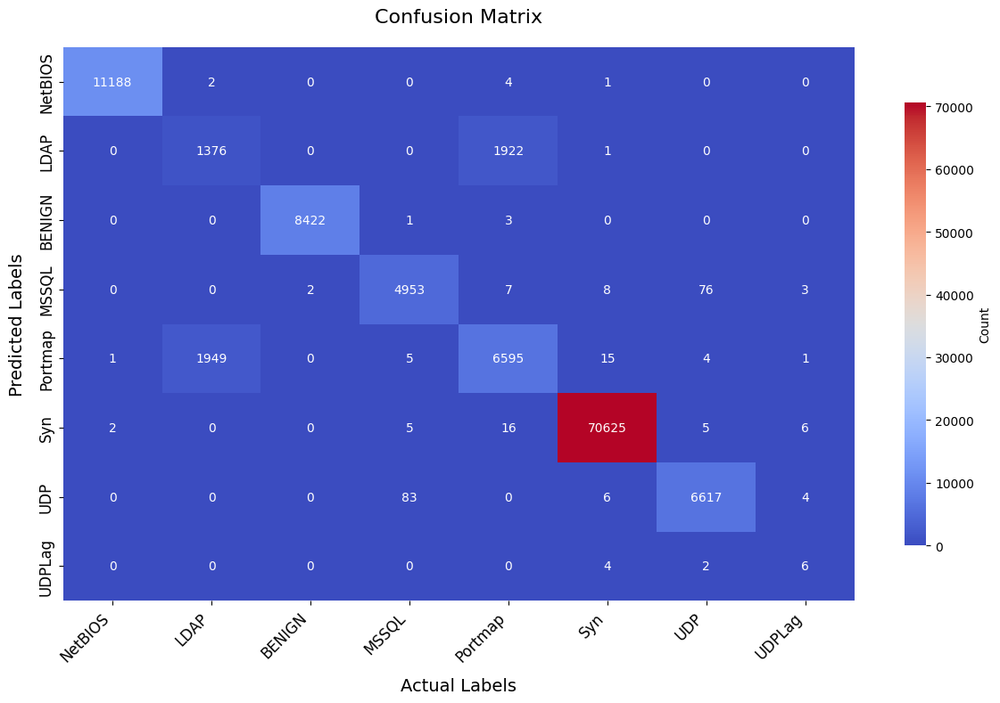

# cicddos-rf

# CICDDoS2019 DDoS Detection with Random Forest

[](https://github.com/yourusername/cicddos-rf) [](https://www.unb.ca/cic/datasets/ddos-2019.html)

Multiclass classification of DDoS attacks (NetBIOS, LDAP, MSSQL, etc.) using Random Forest on the CICDDoS2019 dataset.

## 🎯 Problem
Detect 8 DDoS attack types vs BENIGN traffic from network flows. Real-world cybersecurity task.

## 📊 Dataset
- **Source**: [CICDDoS2019](https://www.unb.ca/cic/datasets/ddos-2019.html) (combined CSV).
- **Size**: ~569k rows, 80+ features (72 after cleaning).
- **Classes**: BENIGN (0), NetBIOS (1), LDAP (2), MSSQL (3), Portmap (4), Syn (5), UDP (6), UDPLag (7).

Download full data and place in `data/`.

## 🚀 Quick Start
1. Clone: `git clone https://github.com/yourusername/cicddos-rf.git`
2. Install: `pip install -r requirements.txt`
3. Run: `jupyter notebook notebooks/cicddos-random-forest.ipynb`

## 📈 Results
- **Accuracy**: 96% .
- **F1-Score**: High on major attacks.



Top features: Flow Duration, Packet Lengths, IAT stats. [file:17]

## 📁 Repository Structure

```text
cicddos-rf/
├── README.md                 # Project overview and results
├── requirements.txt          # Python dependencies
├── data/                     # Dataset or dataset instructions
├── notebooks/
│   └── cicddos-random-forest.ipynb
└── images/
    └── confusion_matrix.png
```
